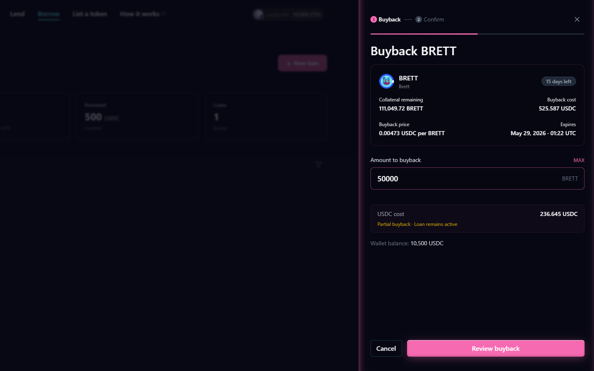
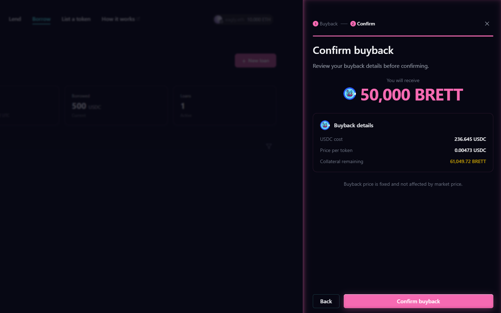
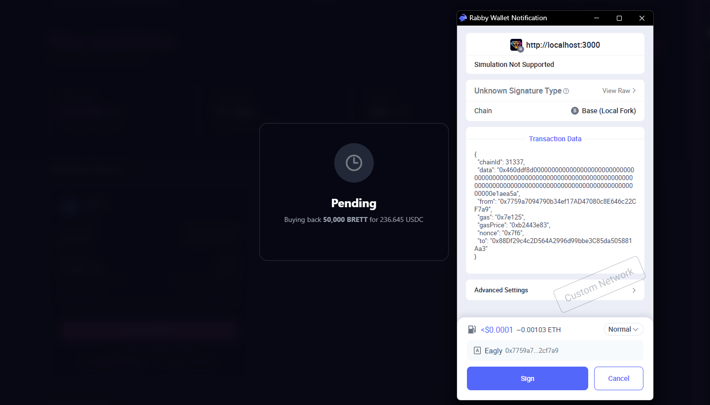
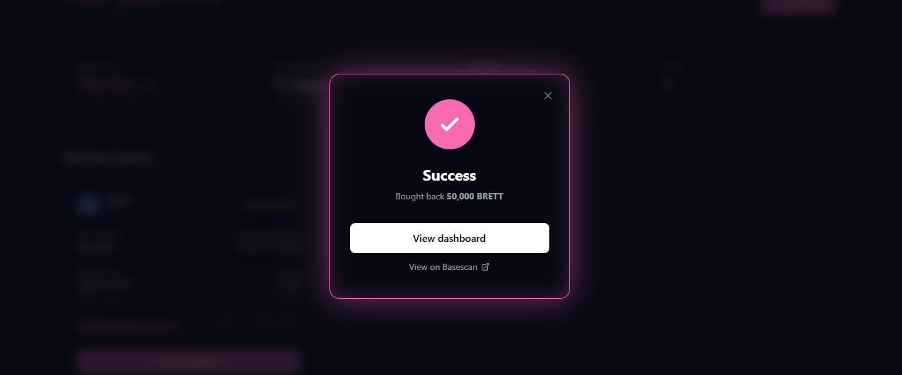
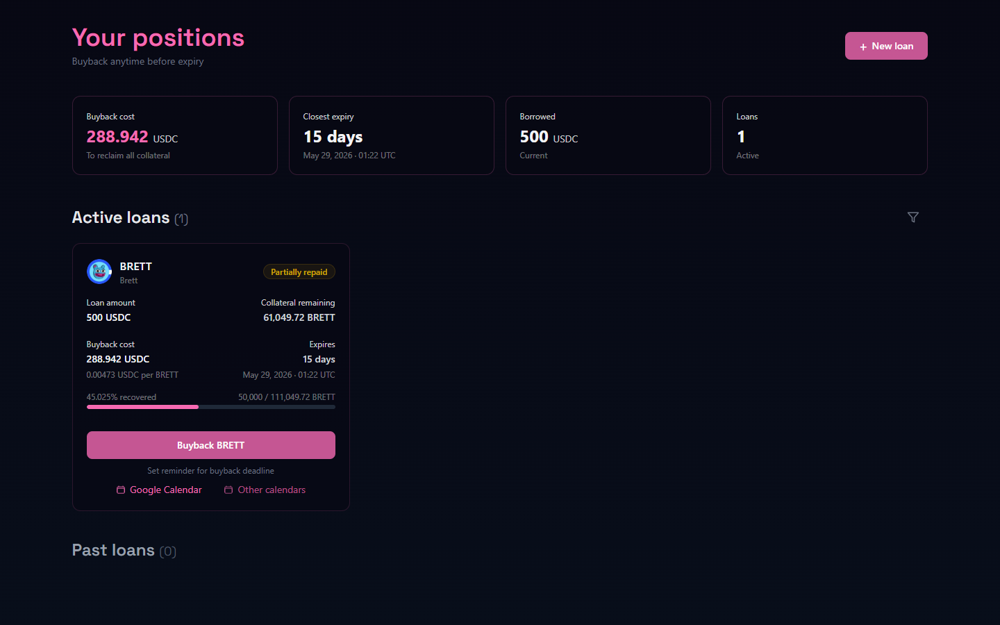
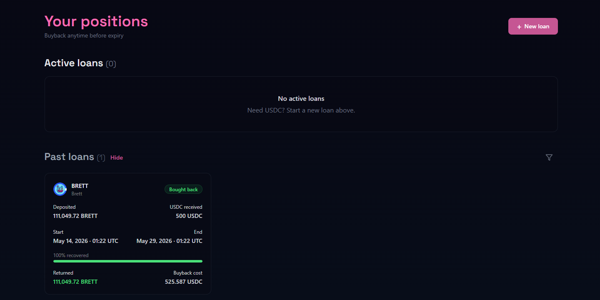

# Buying back your collateral

You need: enough USDC in your wallet to cover the buyback cost, or whatever partial amount you want to pay.

***

## Step 1: Open the buyback drawer

On your borrow dashboard, click **Buyback** on the loan you want to reclaim. The buyback drawer opens showing your total cost and how much collateral you get back.

To do a partial buyback, enter a smaller amount. The drawer shows exactly how much collateral you receive for what you pay. Minimum is $1 USDC.

<figure><figcaption></figcaption></figure>

***

## Step 2: Review the buyback

Confirm the amount you are paying and the collateral you will receive back. Click **Confirm** when ready.

<figure><figcaption></figcaption></figure>

***

## Step 3: Sign in your wallet

Approve the transaction in your wallet. Your USDC is sent to the protocol and your collateral is returned in the same transaction.

<figure><figcaption></figcaption></figure>

***

## Step 4: Buyback confirmed

You will see a success screen. Your collateral has been returned to your wallet.

<figure><figcaption></figcaption></figure>

***

## Partial buybacks

If you paid less than the full buyback cost, the loan stays open with a reduced remaining balance. The progress bar on your dashboard shows how much you have already bought back.

<figure><figcaption></figcaption></figure>

***

## Fully closed

Once the full buyback cost is paid, the loan closes and moves to your past loans. A green bar confirms it was fully bought back.

<figure><figcaption></figcaption></figure>

***


USDC for buybacks is approved to the LendingLedger contract. Your wallet will show the correct address automatically.

