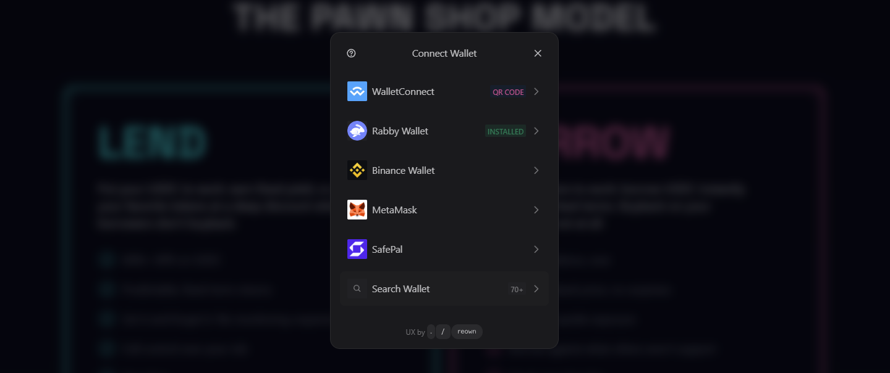
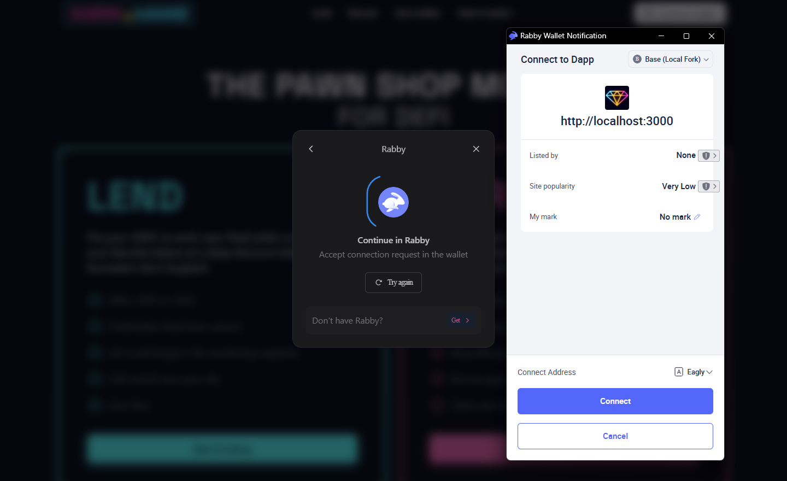

# Connecting your wallet

## Step 1: Open Based Loans

Go to [based.loans](https://based.loans). You will see a **Connect wallet** button in the top-right corner.

<figure><figcaption></figcaption></figure>

***

## Step 2: Choose your wallet

Click **Connect wallet**. A modal opens with the supported wallet options. Select yours: MetaMask, Rabby, Coinbase Wallet, WalletConnect, and others are all supported.

<figure><figcaption></figcaption></figure>

***

## Step 3: Approve the connection in your wallet

Your wallet will ask you to approve the connection to based.loans. Click **Connect** or **Approve** in your wallet popup. Make sure you are connecting to **Base** (chainId 8453).

<figure><figcaption></figcaption></figure>

***

## Step 4: You are connected

Your wallet address now appears in the top-right corner. You are ready to borrow or lend.

<figure><figcaption></figcaption></figure>

***


To switch wallets or disconnect, click your address in the top-right corner and use the options shown.

