# Depositing as a lender

You need: USDC on Base and ETH for gas.

***

## Step 1: Open the Lend page

Click **Lend** in the top navigation. If you have not deposited before, you will see the new lender screen. Click **Start lending**.

<figure>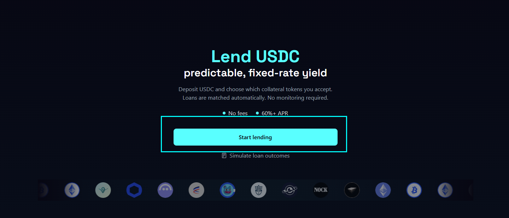<figcaption></figcaption></figure>

***

## Step 2: Select your collateral tokens

Choose which tokens you are willing to accept as collateral. Only tokens you select here will ever back your loans. You can change this at any time after.

<figure>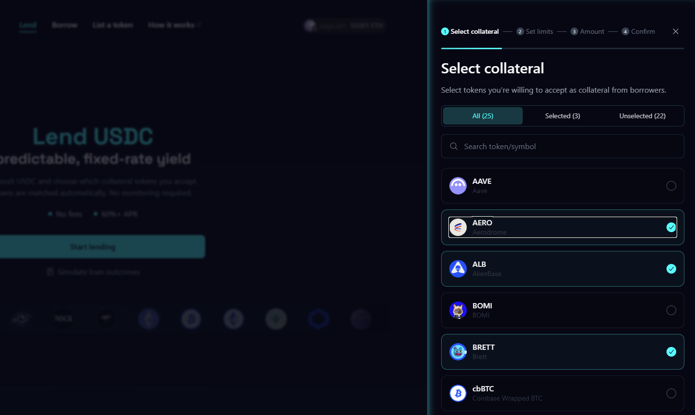<figcaption></figcaption></figure>

***

## Step 3: Set your limits

For each token you selected, set a cap — the maximum USDC that can be matched to loans backed by that token. This controls how much of your deposit is at risk per asset.

<figure>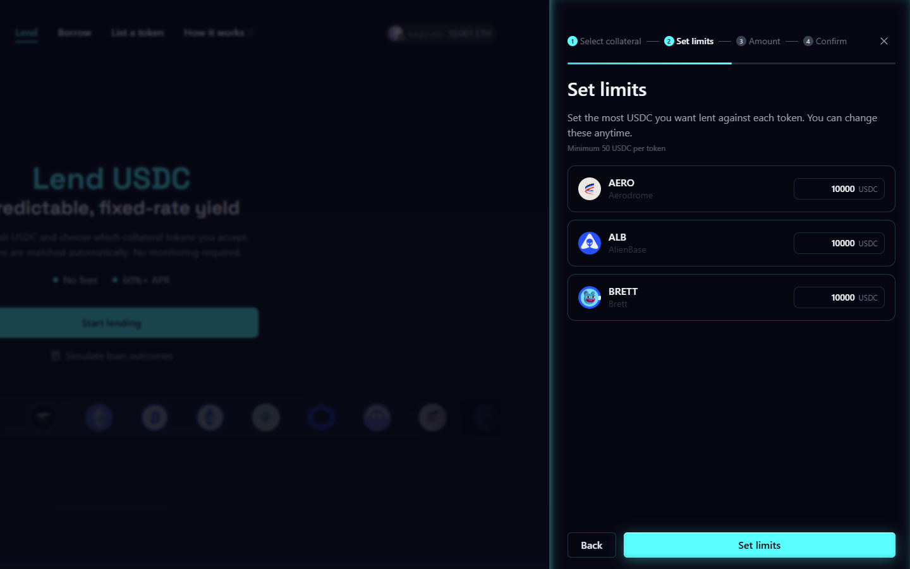<figcaption></figcaption></figure>

***

## Step 4: Enter your deposit amount

Enter how much USDC you want to deposit. The minimum is $200.

<figure>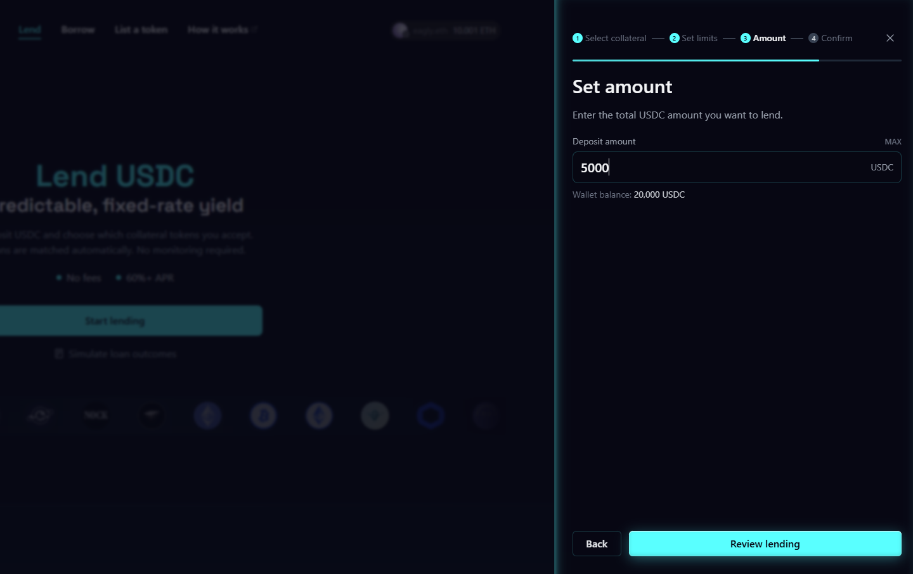<figcaption></figcaption></figure>

***

## Step 5: Review and confirm

Check your collateral selections, caps, and deposit amount before proceeding. Click **Confirm** when ready.

<figure>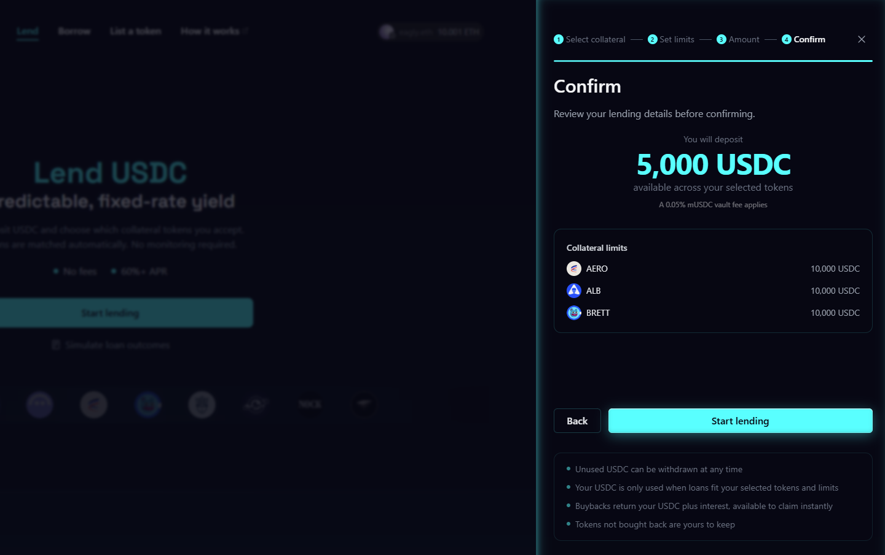<figcaption></figcaption></figure>

***

## Step 6: Approve USDC

The protocol needs your approval to accept USDC. Click **Approve** and sign the transaction in your wallet.

<figure>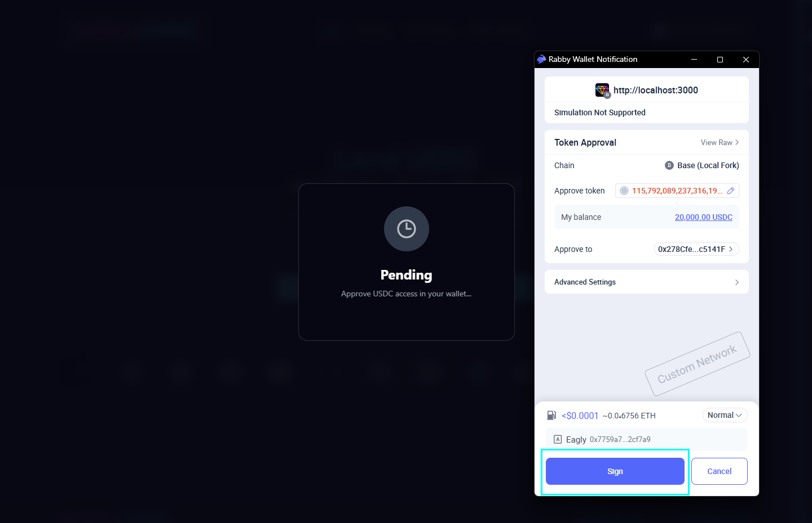<figcaption></figcaption></figure>

***

## Step 7: Confirm the deposit

Once approval is done, sign the deposit transaction in your wallet to finalize everything.

<figure>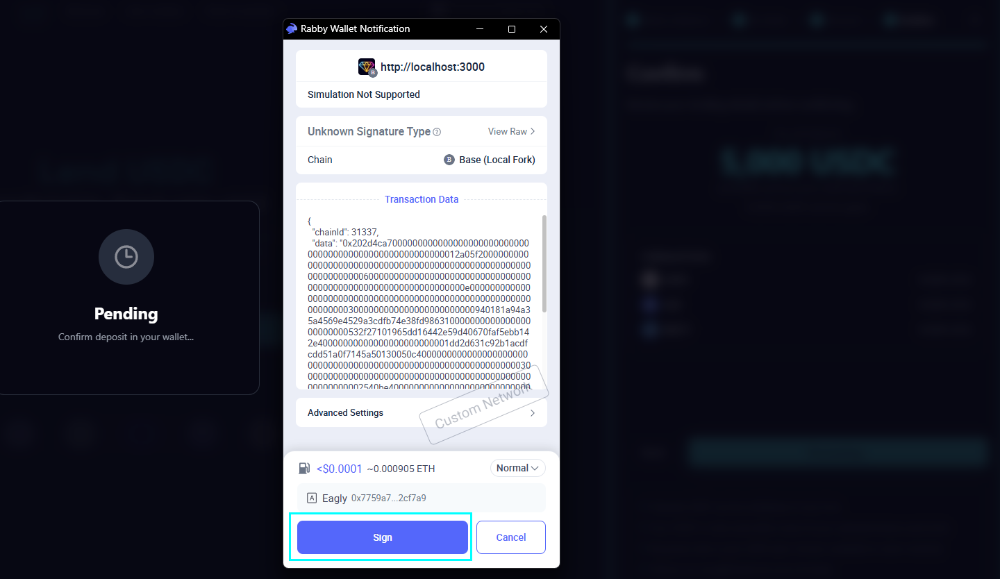<figcaption></figcaption></figure>

***

## Step 8: Deposit confirmed

You will see a success screen. Your USDC is now in the protocol and your collateral settings are live.

<figure>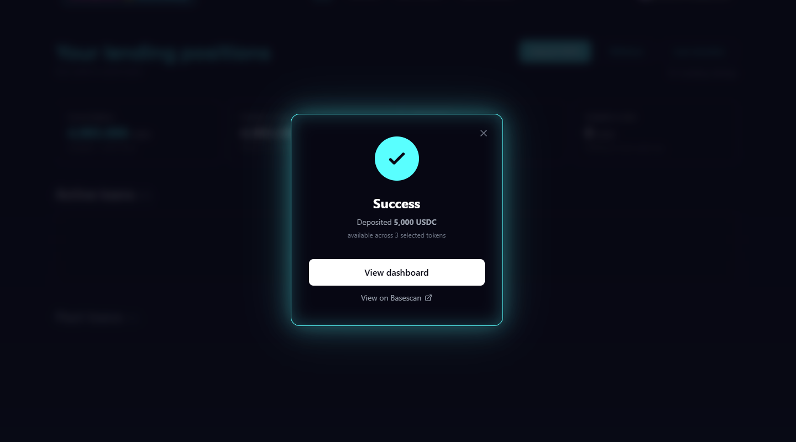<figcaption></figcaption></figure>

***

## Step 9: Your lend dashboard

The dashboard shows your total deposit, how much is matched to active loans, and how much is idle. Matching happens automatically — nothing else to do.

<figure>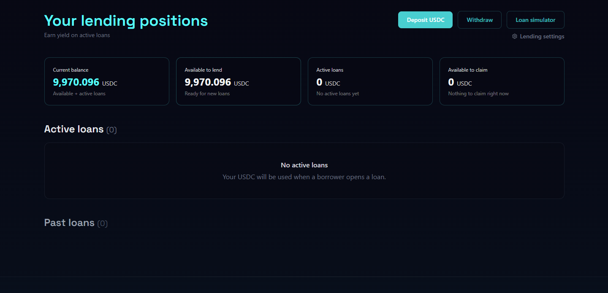<figcaption></figcaption></figure>

***

## Withdrawing

To withdraw, open the withdraw panel from your dashboard. Note that only your idle (unmatched) USDC is available to withdraw. USDC matched to active loans is locked until those loans resolve.

<figure>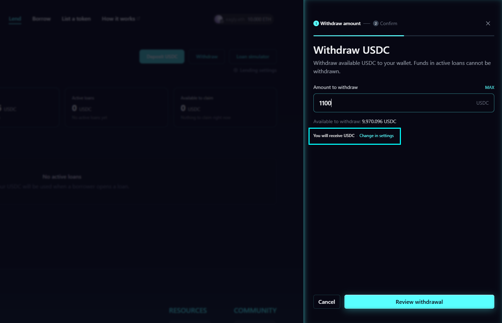<figcaption></figcaption></figure>

***

## Managing your settings

Click **Lender settings** at any time to adjust which tokens you back and update your caps. Changes take effect immediately for new loan matches and do not affect existing open loans.

<figure>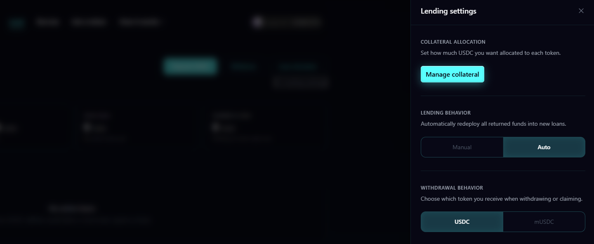<figcaption></figcaption></figure>

***


Idle USDC earns passive yield through the mUSDC vault automatically while it waits for a loan match.

