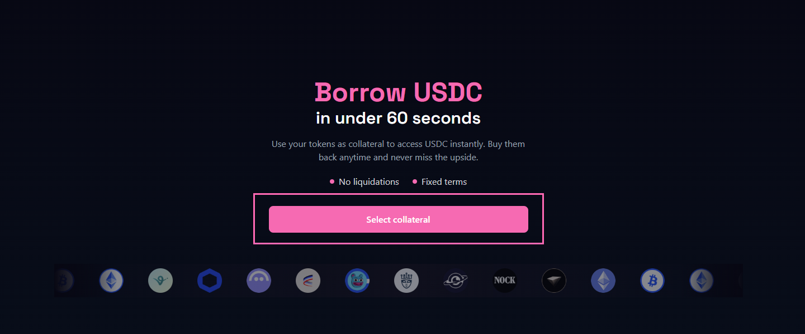
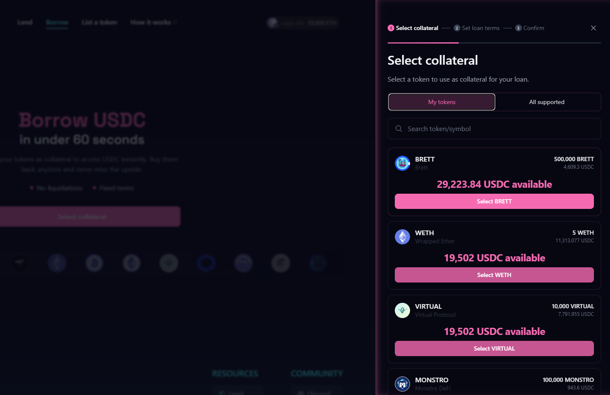
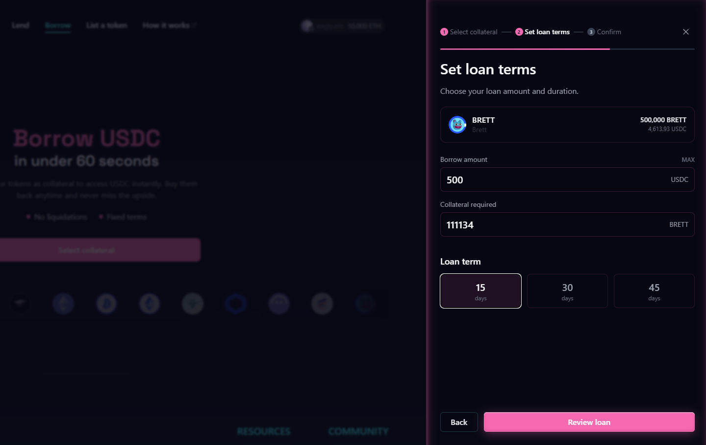
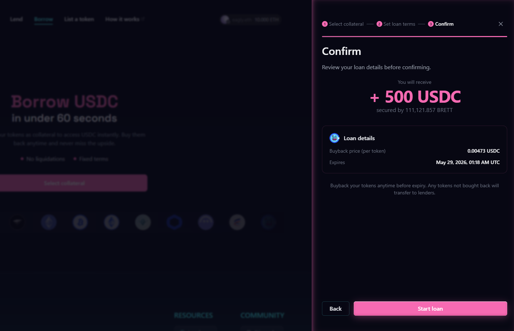
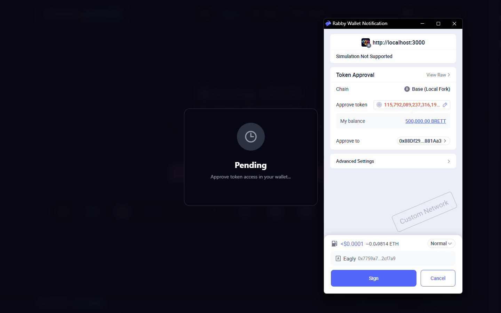
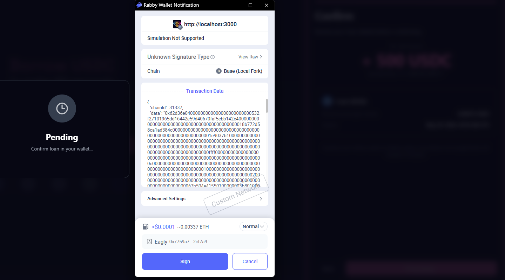
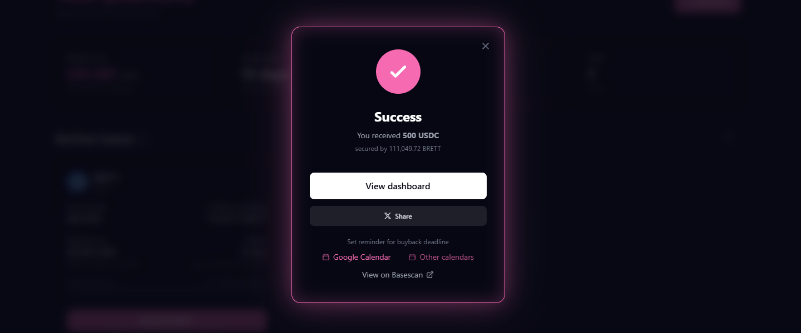
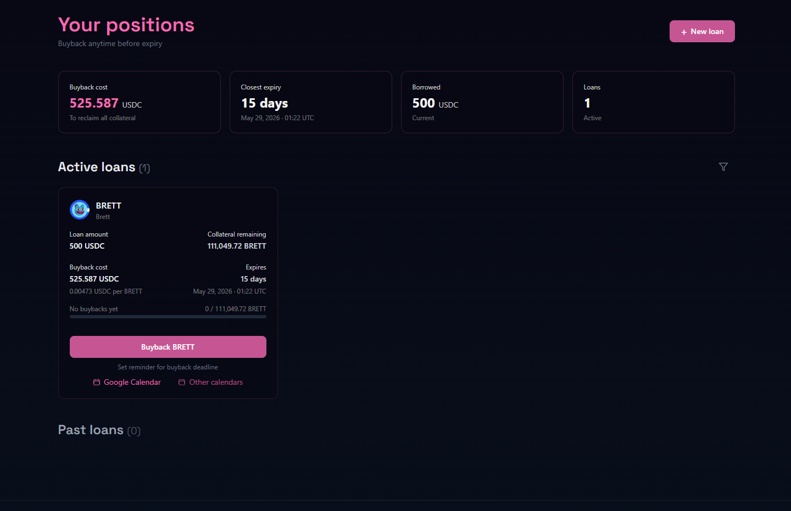

# Opening a loan

You need: a supported collateral token in your wallet, ETH for gas, and an active lender covering your chosen token.

***

## Step 1: Go to Borrow

Click **Borrow** in the top navigation.

<figure><figcaption></figcaption></figure>

***

## Step 2: Select your collateral token

Click the token selector and choose the token you want to borrow against.

<figure><figcaption></figcaption></figure>

***

## Step 3: Enter the amount

Type in how many tokens you want to deposit. The panel on the right updates instantly to show:

* USDC you will receive
* Protocol fee deducted at open
* Buyback cost
* Loan expiry date

<figure><figcaption></figcaption></figure>

***

## Step 4: Choose your term

Select **15**, **30**, or **45** days. Shorter terms cost less. You cannot change this after the loan opens.

<figure><figcaption></figcaption></figure>

***

## Step 5: Review your loan summary

Check the numbers before you continue. The USDC you receive and the buyback cost are both fixed at this point and will not change.

<figure><figcaption></figcaption></figure>

***

## Step 6: Approve your token

Click **Approve**. Your wallet will ask you to allow the Based Loans contract to transfer your collateral. Confirm in your wallet.

This only happens once per token. If you have approved before, this step is skipped.

<figure><figcaption></figcaption></figure>

***

## Step 7: Open the loan

Click **Open loan** and confirm the transaction in your wallet. Your collateral is transferred and USDC lands in your wallet.

<figure><figcaption></figcaption></figure>

***

## Step 8: Your loan is live

You will see a success confirmation. Your loan now appears under **Active loans** on the Borrow page. The buyback cost and expiry date are shown there for reference.

<figure><figcaption></figcaption></figure>

***


Set a reminder before your loan expires. Once the term ends, buyback is no longer possible and your collateral transfers to the lender.

